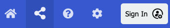
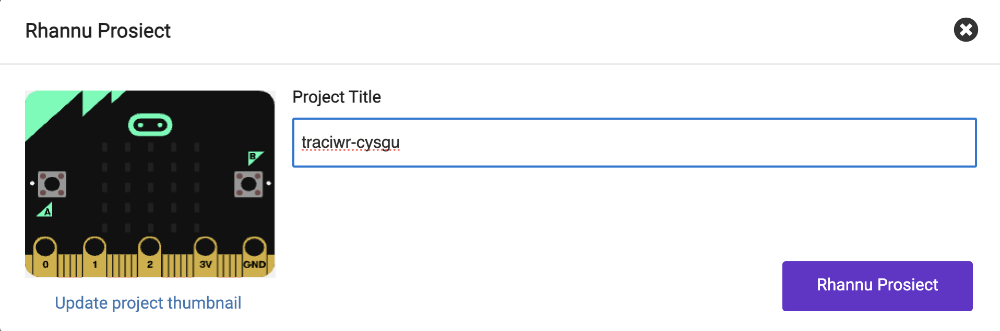
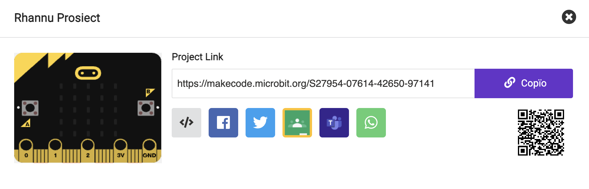

I adael i bobl eraill gael mynediad i'ch prosiect, gallwch rannu cyfeiriad gwe unigryw eich prosiect.

Ar ochr dde uchaf MakeCode mae'r bar dewislen.

Cliciwch ar y botwm rhannu.

Bydd hyn yn agor ffenestr y prosiect.

Os nad ydych wedi enwi eich prosiect eisoes, gallwch wneud hynny nawr.

Cliciwch ar y botwm **Rhannu Prosiect**.

Bydd hyn yn creu fersiwn newydd o'ch prosiect a dolen iddo.

Cliciwch **Copi** ac yna gludwch y ddolen i mewn i neges, neu ysgrifennwch y ddolen i'w rhoi i'r person rydych chi am rannu'r prosiect ag ef.

**Awgrym:** 💡 Bydd pobl sy'n agor y ddolen hon yn cael eu fersiwn eu hunain o'ch prosiect. Ni fyddant yn gallu newid eich fersiwn.
