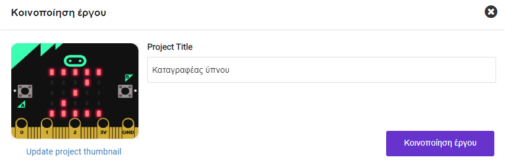
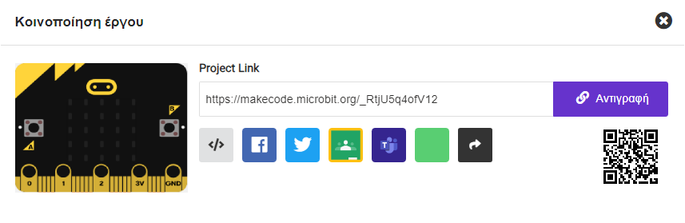

Για να επιτρέψεις σε άλλα άτομα να έχουν πρόσβαση στο έργο σου, μπορείς να μοιραστείς τη μοναδική διαδικτυακή διεύθυνση του έργου σου.

Πάνω δεξιά στο MakeCode υπάρχει η γραμμή μενού.

Κάνε κλικ στο κουμπί κοινοποίησης.

Αυτό θα ανοίξει το παράθυρο του έργου.

Αν δεν έχεις ήδη ονομάσει το έργο σου, μπορείς να το κάνεις τώρα.

Κάντε κλικ στο κουμπί **Κοινοποίηση έργου**.

Αυτό θα δημιουργήσει μια νέα έκδοση του έργου σου και έναν σύνδεσμο προς αυτό.

Κάνε κλικ στο **Αντιγραφή** και, στη συνέχεια, επικόλλησε τον σύνδεσμο σε ένα μήνυμα ή σημείωσε τον σύνδεσμο για να τον δώσεις στο άτομο με το οποίο θέλεις να μοιραστείς το έργο.

**Συμβουλή:** 💡 Τα άτομα που ανοίγουν αυτόν τον σύνδεσμο θα λάβουν τη δική τους έκδοση του έργου σου. Δεν θα μπορούν να αλλάξουν την δική σου έκδοση.
