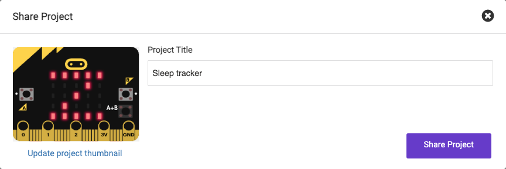
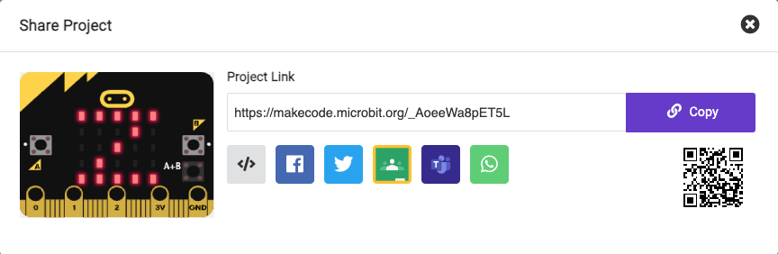

To let other people access your project, you can share your project's unique web address.

At the top right of MakeCode is the menu bar.

Click on the share button.
 
 

This will open the project window.

If you have not already named your project, you can do that now.

Click the Share Project button.

This will create a new version of your project and a link to it.

Click **Copy** and then paste the link into a message, or write down the link to give to the person you want to share the project with.

**Tip:** 💡 People who open this link will get their own version of your project. They will not be able to change your version.