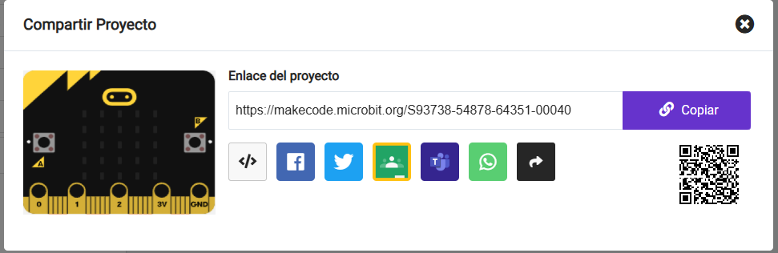

Para que otras personas puedan acceder a tu proyecto, puedes compartir la dirección web única de tu proyecto.

En la parte superior derecha de MakeCode se encuentra la barra del menú.

Click en el botón compartir.

Esto abrirá la ventana del proyecto.

Si aún no le has puesto nombre a tu proyecto, puedes hacerlo ahora.

Da click en el boton **Nuevo Proyecto**.

Esto creará una nueva versión de tu proyecto y un enlace a él.

Da clic en **Copiar** y luego pega el enlace en un mensaje, o escribe el enlace para dar a la persona con la que deseas compartir el proyecto.

**Consejo:** 💡 Las personas que abran este enlace obtendrán su propia versión de tu proyecto. Ellos no podrán alterar tu versión.
