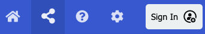
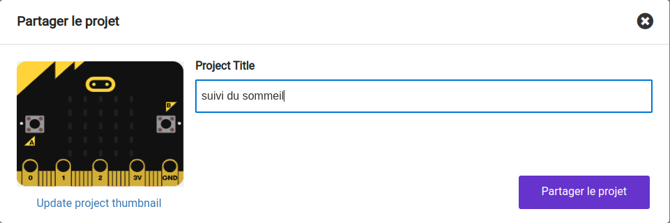
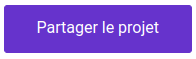
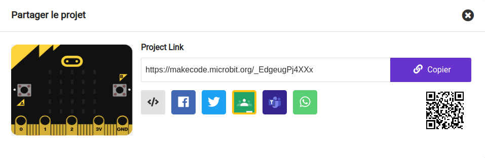

Pour permettre à d'autres personnes d'accéder à ton projet, tu peux partager l'adresse Web unique de ton projet.

En haut à droite de MakeCode, il y a la barre de menus.

Clique sur le bouton Partager.

Cela ouvrira la fenêtre du projet.

Si tu n'as pas encore nommé ton projet, tu peux le faire maintenant.

Clique sur le bouton **Partager le projet**.

Cela créera une nouvelle version de ton projet et un lien vers celui-ci.

Clique sur **Copier** puis colle le lien dans un message, ou note le lien à donner à la personne avec qui tu souhaites partager le projet.

**Astuce :** 💡 Les personnes qui ouvriront ce lien obtiendront leur propre version de ton projet. Ils ne pourront pas changer ta version.
