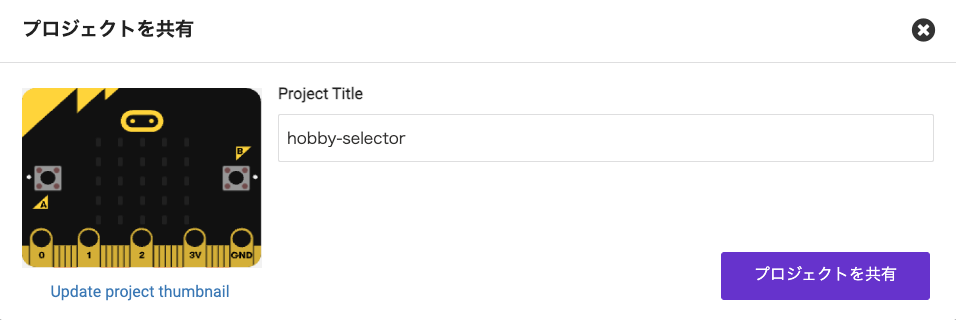
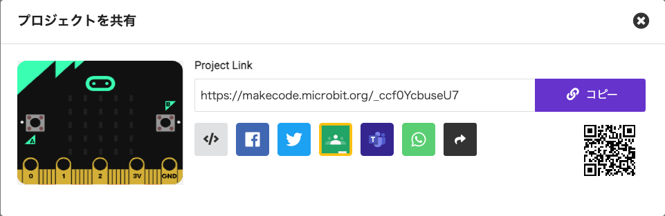

他のユーザーがプロジェクトにアクセスできるようにするため、プロジェクトの Web アドレスを共有できます。

MakeCode の右上にはメニューバーがあります。

共有ボタンをクリックします。

プロジェクト ウィンドウが開きます。

プロジェクトにまだ名前を付けていない場合は、ここで名前を付けることができます。

**プロジェクトを共有** ボタンをクリックします。

これにより、プロジェクトの新しいバージョンとリンクが作成されます。

**コピー** をクリックし、リンクをメッセージに貼り付けるか、リンクを書き留めてプロジェクトを共有したい相手に渡します。

**ヒント:** 💡 このリンクを開いた人は、自分のプロジェクトのバージョンを取得します。 あなたのバージョンを変更することはできません。
