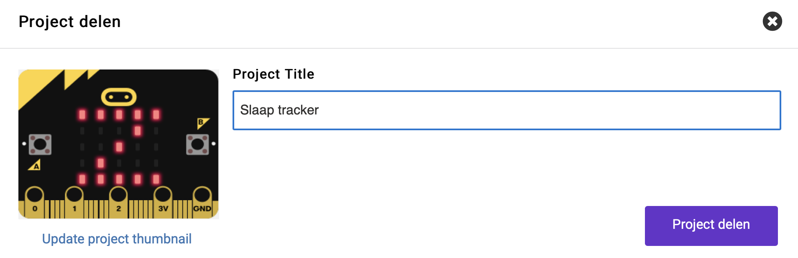
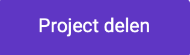
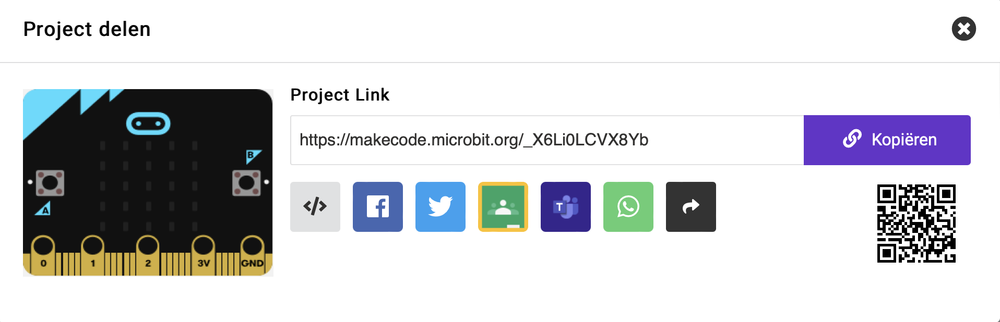

Om andere mensen toegang te geven tot je project, kun je het unieke webadres van je project delen.

Aan de rechterbovenkant van MakeCode is de menubalk.

Klik op de knop delen.

Hierdoor wordt het projectvenster geopend.

Als je jouw project nog geen naam hebt gegeven, kun je dat nu doen.

Klik op de knop **Project delen**.

Hierdoor wordt een nieuwe versie van jouw project gemaakt en een link ernaartoe.

Klik op **Kopiëren** en plak vervolgens de link in een bericht, of schrijf de link op en geef hem aan de persoon waarmee je het project wilt delen.

**Tip:** 💡 Mensen die deze link openen krijgen hun eigen versie van je project. Ze kunnen jouw versie niet wijzigen.
